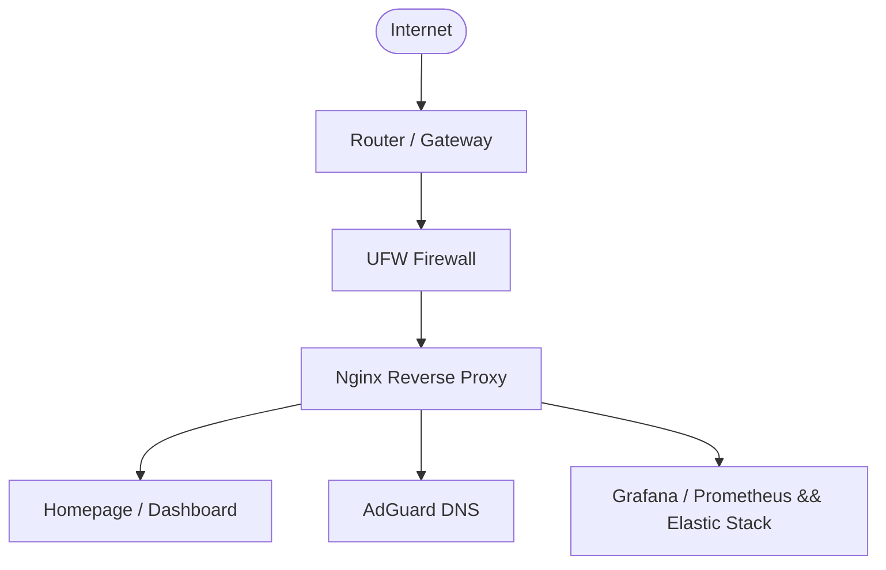

# homelab-server
Self-hosted home server running Ubuntu Server and Docker microservices accessed through Tailscale.

---

## Hardware & Operating System Specifications

| Component | Specifications |
| :--- | :--- |
| **CPU** | Intel Core i5-6400 (4 Cores @ 2.70GHz) |
| **RAM** | 20GB DDR4 (Optimized via 8GB Swap Partition & `swappiness=10`) |
| **Boot Drive** | 232GB HDD (EXT4 & LVM Volume Management) |
| **Storage Pool** | 1TB HDD (EXT4, auto-mounted at `/mnt/storage` via `/etc/fstab`) |
| **Network** | Wired CAT7 Gigabit Ethernet on 100Mbps Fiber Line |
| **OS** | Headless Ubuntu Server 26.04 LTS (Resolute Raccoon) |

---

## Network & System Optimizations

* **Gigabit Network Tuning:** Configured Google BBR (`net.ipv4.tcp_congestion_control=bbr`), forced 1492 MTU, and disabled Ethernet EEE power-saving to maximize fiber throughput.
* **Power & Keep-Alive Rules:** Created custom `/etc/udev/rules.d/70-wifi-powersave.rules` and kernel parameters (`usbcore.autosuspend=-1`) to prevent interface sleep loops.
* **Hardened Access:** Configured OpenSSH server with `sudoers` administrative privileges, backed by `fail2ban` brute-force IP jailing.
* **Zero-Trust Remote VPN:** Integrated **Tailscale Mesh VPN** (`100.x.y.z` overlay) for encrypted remote access without opening dangerous router ports.

## Containerized Services (Docker Stack via Portainer)

### 1. FileBrowser (Family Cloud NAS)

* Web-based file management interface mapped to `/mnt/storage`.
* Configured 30-day persistent sessions (`--token-expiration 720`) and mobile PWA home-screen shortcuts for non-technical family users.

### 2. Samba (SMB Shares)

* Exposes `/mnt/storage` as `[HomeCloud]` across local LAN and Tailnet.
* Seamless network drive integration (`Z:\`) for Windows File Explorer and Linux Mint (`smb://`).

### 3. AdGuard Home (Network-Wide DNS Blocker)

* Intercepts DNS queries on Port 53; multi-upstream failover (Cloudflare, Google, Quad9) with disabled IPv6 resolution to eliminate DNS leaks.

### Miscellaneous Services
### Managed through Portainer

This server runs microservices deployed via **Docker Compose** and managed through **Portainer**.

### Services Overview

| Service | Function / Description | Host Port(s) | Managed By |
| :--- | :--- | :--- | :--- |
| `adguardhome` | DNS sinkhole & network-wide ad blocking | `3000`, `53` | `Docker Compose (CLI)` |
| `elasticsearch` | Search & analytics engine for SIEM | `9200` | Portainer Stack (`blue-siem`) |
| `filebrowser` | Web-based file manager UI | `8080` | `Docker Compose (CLI)` |
| `grafana` | Metrics visualization & dashboards | `3003` | Portainer Stack (`loki-siem`) |
| `homepage` | Dashboard & application landing page | `8082` | Portainer Stack (`homepage`) |
| `immich_machine_learning` | Facial recognition & CLIP analysis backend | *Internal* | Portainer Stack (`immich`) |
| `immich_postgres` | Vector-enabled database for photo metadata | *Internal* | Portainer Stack (`immich`) |
| `immich_redis` | Job queue & cache store (Valkey) | *Internal* | Portainer Stack (`immich`) |
| `immich_server` | Self-hosted photo & video backup solution | `2283` | Portainer Stack (`immich`) |
| `kavita` | Digital library for Manga, Comics, & E-books | `5001` | Portainer Stack (`manga_stack`) |
| `kibana` | Search & log visualization UI for Elasticsearch | `5601` | Portainer Stack (`blue-siem`) |
| `loki` | Log aggregation and indexing engine | `3100` | Portainer Stack (`loki-siem`) |
| `mc-server` | Dedicated Minecraft server instance | `25566` | Portainer Stack (`minecraft-server`) |
| `mongo_express` | Web-based administrative UI for MongoDB | `8083` | Portainer Stack (`mongodb-stack`) |
| `mongodb` | NoSQL database instance | `27017` | Portainer Stack (`mongodb-stack`) |
| `nginx-proxy-manager` | Reverse proxy and automated SSL management | `80`, `81`, `443` | Portainer Stack (`npm`) |
| `portainer` | Docker environment management UI | `8000`, `9443` | Docker Standalone |
| `promtail` | Log shipper agent for Grafana Loki | *Internal* | Portainer Stack (`loki-siem`) |
| `prowlarr` | Torrent/Usenet indexer manager | `9696` | Portainer Stack (`manga_stack`) |
| `transmission` | BitTorrent download manager | `9091`, `51413` | Portainer Stack (`manga_stack`) |
| `uptime-kuma` | Service uptime and monitoring dashboard | `3001` | Portainer Stack (`uptime-kuma`) |

--- 

